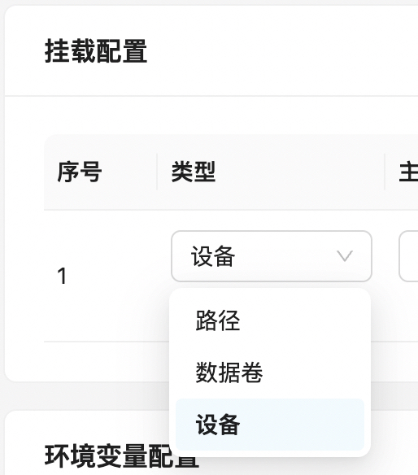
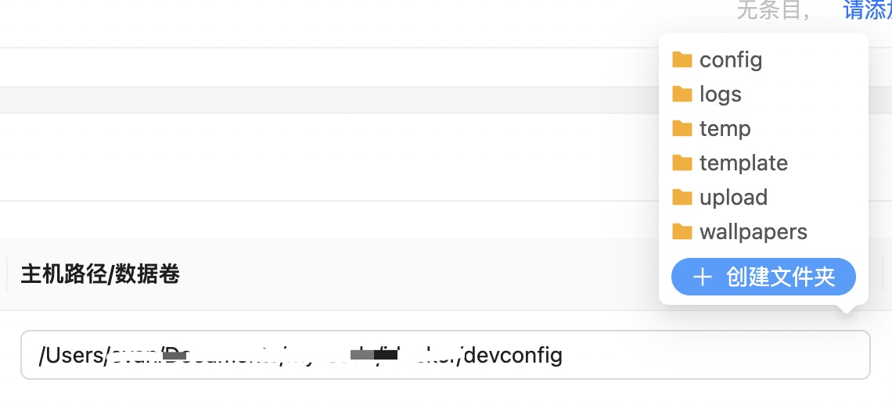
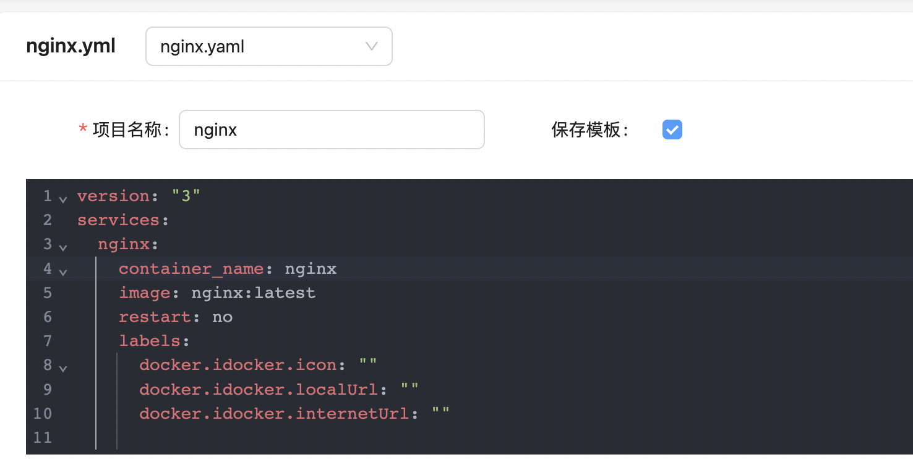

# 容器

## 一、创建容器
`iDocker` 在`PC`下有三种模式创建容器，分为基础模式、高级模式、`compose`模式。在移动端只有基础模式

### 1.1 基础模式、高级模式
基础模式适合对`docker`不是很了解的用户，它相比高级模式隐藏了一些不必要的设置项，适合创建一些只需要挂载路径和映射端口的简单容器，减少不必要的选项避免误操作。

高级模式适合创建一些需要多网络、特殊能力的容器，高级模式的设置项更多一些，适合对`docker`比较了解的用户更细节的控制创建

他们的功能对比如下

| 功能              | 基础模式   | 高级模式                |
| ----------------- | ---------- | ----------------------- |
| 图标              | &#10004;   | &#10004;                |
| 内外网地址        | &#10004;   | &#10004;                |
| 重启策略          | &#10004;   | &#10004;                |
| 端口配置          | &#10004;   | &#10004;                |
| 挂载配置          | &#10004;   | &#10004;                |
| 环境变量配置      | &#10004;   | &#10004;                |
| 镜像源            | 官方镜像源 | 支持切换镜像源          |
| 网络              | 单网络     | 多网络且支持配置ip、mac |
| hostname          | &#10008;   | &#10004;                |
| domainName        | &#10008;   | &#10004;                |
| 启动命令          | &#10008;   | &#10004;                |
| Hosts文件配置     | &#10008;   | &#10004;                |
| 特权模式          | &#10008;   | &#10004;                |
| CPU、内存资源限制 | &#10008;   | &#10004;                |
| 能力限制          | &#10008;   | &#10004;                |

#### 1.1.1 设备挂载
在挂载配置中可进行设备挂载，路径为宿主机设备路径和容器设备路径，只读开启代表`r`，关闭代表`rwm`

#### 1.1.2 路径提示
为方便创建容器时填写路径，`iDocker`针对宿主机已挂载到`iDocker`容器内的路径可以进行提示

建议将所有容器的配置文件放到一个文件夹然后挂载到`iDocker`内，然后在【设置】->【docker设置】->【预填充路径】中将该文件夹的宿主机路径填入，这样每次在新增挂载时都会自动填入预填充路径，然后针对后续文件夹路径进行提示

同时在提示弹窗内还支持新建文件夹，在创建新容器时新建配置文件夹时会很方便

### 1.2 `compose`模式
`compose`模式则是编辑`yaml`配置文件使用`docker compose`命令创建容器的模式.

`Compose` 项目是 `Docker` 官方的开源项目，负责实现对 `Docker` 容器集群的快速编排。在日常开发工作中，经常会碰到需要多个容器相互配合来完成某项任务的情况。例如要实现一个 `Web` 项目，除了 `Web` 服务容器本身，往往还需要再加上后端的数据库服务容器；再比如在分布式应用一般包含若干个服务，每个服务一般都会部署多个实例。如果每个服务都要手动启停，那么效率之低、维护量之大可想而知。这时候就需要一个工具能够管理一组相关联的的应用容器，这就是`Docker Compose`.

`compose`模式支持`yaml`格式的配置，创建时可保存为模版，以便下次重新创建时复用

::: tip 提示
由于`compose`支持了更多基础模式和高级模式不支持的功能，所以只在基础模式和高级模式切换至`compose`模式时提示可将已填写数据转换成`compose`模式的配置，反向无法转换
:::

## 二、管理容器
容器列表页展示了所有已创建的容器，在列表页可对容器进行管理，在操作列现支持查看详情、查看日志、终端、编辑、启动、暂停、恢复、重启、停止、删除等操作

::: tip
出于稳定性考虑，对于`iDocker`本身，只支持查看详情、日志、终端操作。对于非使用`iDocker`普通模式和高级模式创建的容器，编辑操作可能造成不兼容，请谨慎操作。`compose`模式创建的容器建议删除容器使用模版并修改重新创建
:::

### 2.1 检查更新
检查更新会拉取容器`tag`的最新镜像，判断当前镜像是否为最新，如果不是最新，则在操作列显示更新按钮，检查过程耗时较长，为后台进行，视容器数量可稍等几分钟再查看是否需要更新

点击更新按钮时会使用相同配置重新创建容器

