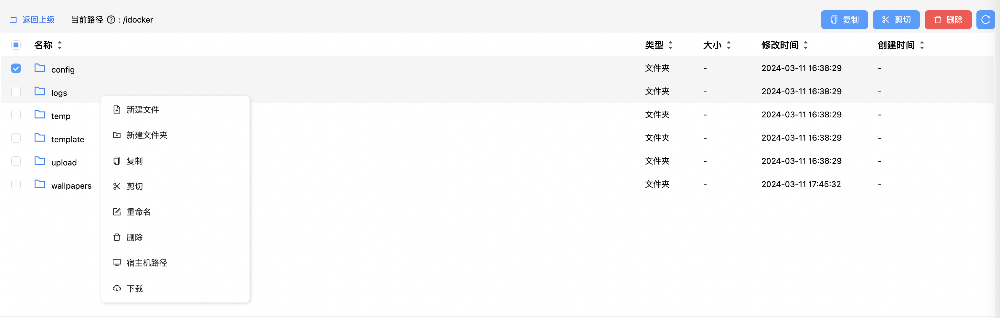
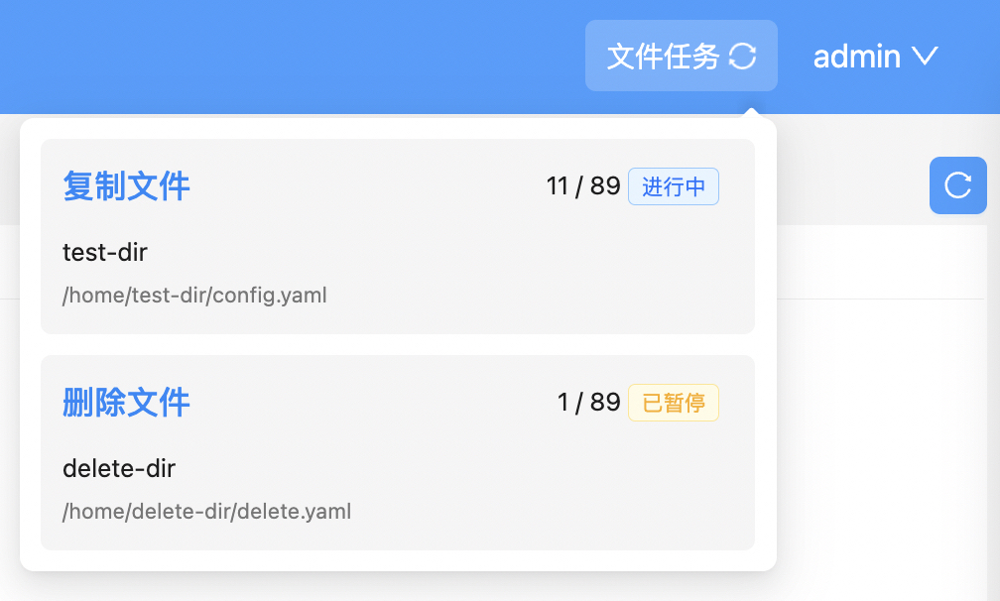

# 文件管理
## 一、支持功能
管理`docker`难免要进行文件管理，例如：创建配置文件夹、查看/修改配置文件，删除缓存文件，文件备份等，所以为了更方便的管理`docker`，`iDocker`集成的基础的文件管理功能。

目前已实现新建文件、新建文件夹、复制、剪切、重命名、删除、上传、下载、查看图片、查看/编辑常见文本文件、获取宿主机路径、排序，搜索等功能。

未来可能会实现的功能：回收站、音视频查看、批量重命名等

::: tip
为稳定性考虑，目前只支持管理宿主机挂载到`iDocker`容器内的文件，且显示的是`iDocker`容器内路径，如果需要获取文件（夹）对应的宿主机路径，可右键文件（夹）点击【宿主机路径】选项获取
:::
## 二、任务队列
由于批量复制、剪切、删除的耗时较长，所以复制、剪切、删除操作为后台任务，有多个任务时会队列执行，此时在用户头像旁显示任务进度，因后台任务导致的文件列表未及时刷新可点击列表右上方的刷新按钮刷新列表

## 三、上传、下载
只需将想要上传的文件(夹)拖拽至文件列表区域即可进行上传，上传时会弹出进度弹窗，需等待上传进度完成才能关闭或刷新网页，否则上传将失败。

目前支持单个文件(夹)下载，如果下载的是文件，则直接进行下载，如果下载的是文件夹，则会下载文件夹的压缩包（为了保持文件夹内的文件路径）

## 四、查看、编辑文本文件
目前支持查看、编辑的文本文件格式为：

* `.txt`
* `.json`
* `.conf`
* `.md`
* `.xml`
* `.html`
* `.yaml`
* `.yml`
* `.toml`
* `.properties`
* `.plist`
* `.ini`
* `.js`
* `.ts`
* `.css`
* `.less`
* `.scss`
* `.tsx`
* `.jsx`
* `.vue`
* `.php`
* `.py`
* `.java`
* `.go`
* `.c`
* `.sh`
* `.rs`
* `.log`
* `.conf`
* `.types`
* `.bat`
* `.sql`
* `.properties`
* `.env`
* `.plist`
  
其中多数格式支持语法高亮，其他文件格式可右键文件点击【以文本打开】选项进行尝试进行文本编辑
