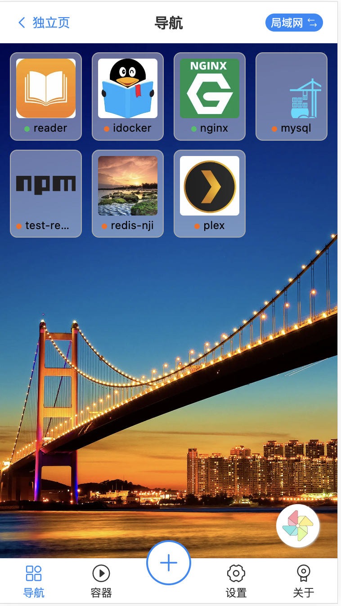
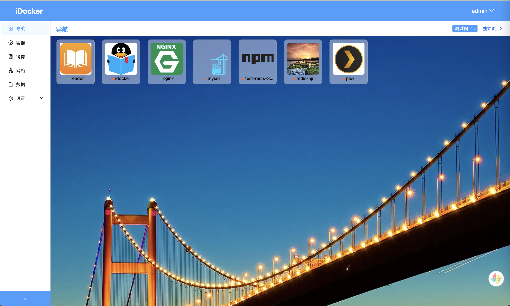
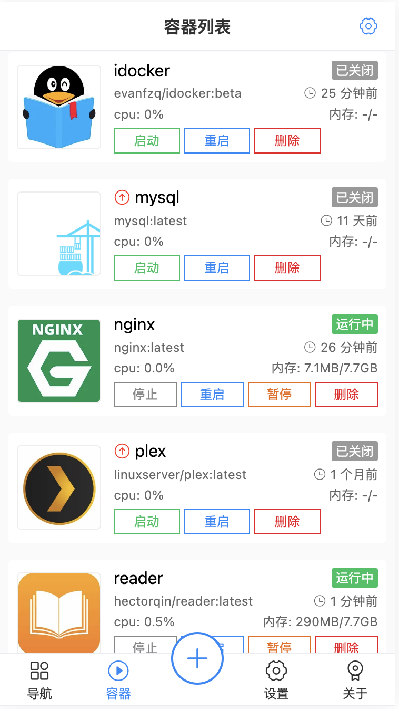
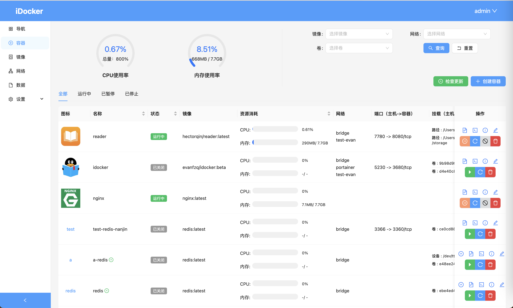
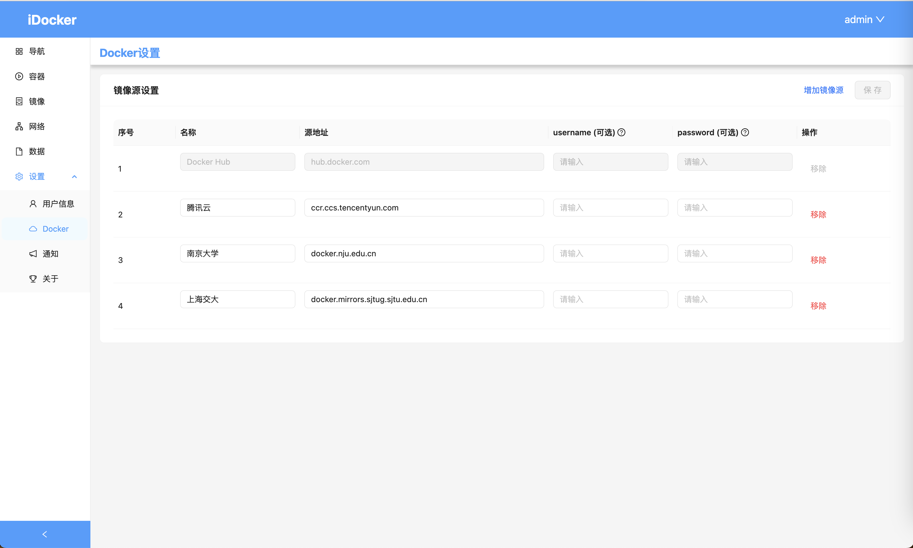
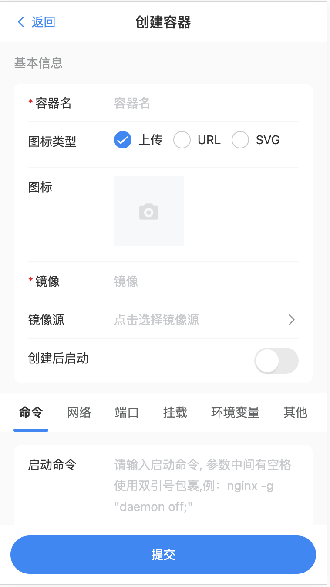
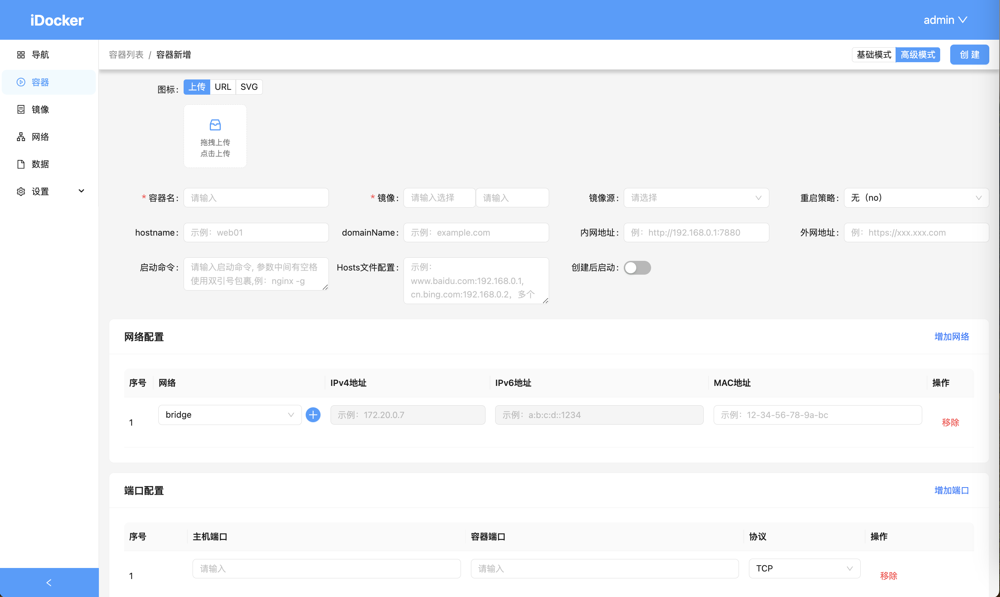

# 介绍
## 一、前言

很多人会用到`docker`去部署一些服务，例如程序员、极客等。对于`docker`服务的管理有很多工具可以使用，例如命令行、`portainer`。对于程序员来说，命令行可能是常用的管理工具。可是对于一些极客或者`NAS`爱好者来说，命令行有点过于复杂，且那么多命令也不好记忆，他们大多会选择使用`portainer`或者`NAS`系统自带的`Docker`管理工具。虽然`portainer`功能已经很丰富了，但是却没有官方中文支持且不支持移动端，UI也不太好看。而`NAS`系统自带的`Docker`管理工具不具有平台通用性，而且大多功能比较简单。所以有了开发`iDocker`这个项目的动机。

## 二、功能介绍
### 2.1 示意图
目前该工具做了移动端和`PC`端适配，采用不同交互设计逻辑，体验更好，对于部分`Nas`爱好者来说，绝对是管理`Docker`的利器，不过部分比较复杂不适合移动端操作的功能只适配了`PC`端，例如容器终端等

|          | 移动端                                       | PC端                                     |
| -------- | -------------------------------------------- | ---------------------------------------- |
| 导航     |               |               |
| 容器管理 |    |    |
| 设置     |           |           |
| 创建容器 |  |  |

### 2.2 已实现的功能
| 功能             | 移动端             | PC端     |
| ---------------- | ------------------ | -------- |
| 用户管理         | &#10004;           | &#10004; |
| 容器管理         | &#10004;           | &#10004; |
| 容器版本更新     | &#10004;           | &#10004; |
| 容器终端         | &#10008;           | &#10004; |
| 导航页           | &#10004;           | &#10004; |
| 管理镜像         | &#10004;           | &#10004; |
| 管理网络         | &#10004;           | &#10004; |
| 管理数据卷       | &#10004;           | &#10004; |
| PWA              | &#10004;           | &#10004; |
| 事件通知         | &#10004;           | &#10004; |
| 支持自定义镜像源 | 仅选用，不支持管理 | &#10004; |
| 路径提示         | &#10004;           | &#10004; |
| compose          | &#10008;           | &#10004; |
| 文件管理         | &#10008;           | &#10004; |

目前在移动端和`PC`端已经实现了基本的帐号、容器、镜像、网络、数据管理；支持检测容器版本及更新；支持容器终端操作；支持容器内外网导航；容器多网络链接；容器挂载设备、权限控制等高级功能

同时针对国内特殊的网络环境，还支持在PC端配置自定义镜像源以及预设了常用的镜像源，在PC端和移动端创建容器时都支持选择自定义镜像源

在用户配置的邮箱相关配置后，还可以通过邮件发送`Docker`相关事件通知

在将宿主机文件夹挂载到`iDocker`后，在创建容器挂载路径时，对于已挂载路径会进行子文件夹提示，极大方便容器创建工作，同时支持设置填充预设路径，可以将所有`docker`应用的配置所在的根文件夹设置预设路径，这样在新增挂载时将默认填充配置根文件夹，只需在根文件夹新建应用的子文件夹并挂载即可。

### 2.3 规划中的功能
| 近期规划 | 中期规划   | 长期规划       |
| -------- | ---------- | -------------- |
| 应用市场 | 支持多语言 | 导航页功能更新 |
|          | UI美化     | 多环境管理     |

预计会增加一下功能
  
- 多语言，实现工具国际化；
- UI美观度优化；
- 应用商城，方便快捷的部署常见应用；
- 多环境管理功能，在一个服务上管理多台机器上的`docker`应用
- 导航页面功能更新，添加更多功能，例如：排序、分组、插件、搜索等