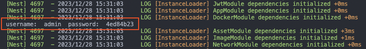

# 快速开始
## 一、环境要求
需服务器安装有`docker`服务。[如何安装docker](https://www.runoob.com/docker/ubuntu-docker-install.html)

对于群晖`Nas`在套件中心中安装`Container Manager`套件即可
## 二、安装

可使用下面两种方式进行安装
### 2.1 使用`docker`安装
使用终端执行下面命令（注意修改`host`配置文件路径）

#### `host` 网络(推荐)

host网络在安装应用时可以直接推测出内网访问地址
```
docker run --name idocker -d --net=host --restart=always -v /var/run/docker.sock:/var/run/docker.sock -v /host/file/path:/docker evanfzq/idocker:latest 
```
#### `Bridge`网络
```
docker run --name idocker -d --restart=always -p 3580:3580 -p 3543:3543 -v /var/run/docker.sock:/var/run/docker.sock -v /host/file/path:/docker evanfzq/idocker:latest 
```
### 2.2 使用 `docker-compose`安装
#### `host` 网络(推荐)
到宿主机对应文件目录下使用下面命令创建文件夹及`docker-compose.yml`文件
```shell
mkdir idocker
cd idocker
touch docker-compose.yml
```
使用`vim`或其他工具修改 `docker-compose.yml`文件如下，配置文件路径请自定义
```yml
version: "3" # 表示该docker-compose.yml文件使用的是Version 3  
services:  # 为project定义服务
  idocker:  # 指定服务名称
    container_name: idocker # 指定容器名
    image: evanfzq/idocker:latest  # 指定服务所使用的镜像
    network_mode: host
    volumes:
      - /var/run/docker.sock:/var/run/docker.sock  # 与docker宿主通信的 sock 地址，勿修改
      - /host/file/path:/docker # 所有docker服务配置文件存放的地方，请修改为自己的磁盘路径
    restart: always
```
在`docker-compose.yml`文件所在文件夹下执行下列命令启动服务
```shell
docker-compose up -d 
```
#### `Bridge`网络
`docker-compose.yml`文件如下，配置文件路径请自定义
```yml
version: "3" # 表示该docker-compose.yml文件使用的是Version 3  
services:  # 为project定义服务
  idocker:  # 指定服务名称
    container_name: idocker # 指定容器名
    image: evanfzq/idocker:latest  # 指定服务所使用的镜像
    networks:
      - idocker-network
    ports:  # 暴露端口信息
      - 3580:3580  # WebUI http
      - 3543:3543 # WebUI https
    volumes:
      - /var/run/docker.sock:/var/run/docker.sock  # 与docker宿主通信的 sock 地址，勿修改
      - /host/file/path:/docker # 所有docker服务配置文件存放的地方，请修改为自己的磁盘路径
    restart: always
networks:
  idocker-network:
    driver: bridge
```
::: info
安装完成后，浏览器打开地址：`http://[服务器IP]:3580` 或`https://[服务器IP]:3543`即可访问
:::
## 三、初始账户密码
服务启动后查看容器日志输出，也可以在`/docker/idocker`对应的宿主机目录下的`logs`文件夹找到`init-password.txt`文件，内有初始密码


初始帐号默认为`admin`，初始密码为随机八位字符串，帐号和密码可在网页端进行修改

