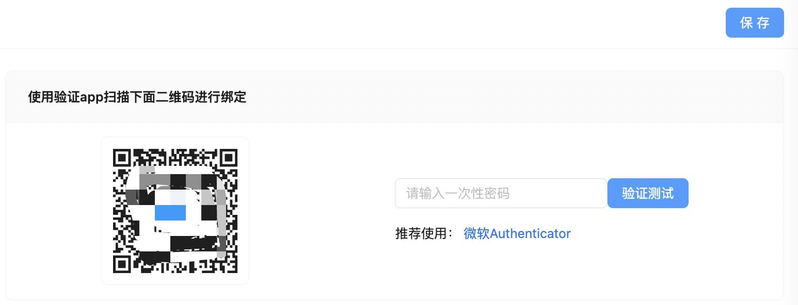

# 安全
## 一、https
未防止页面在网络中明文传输遭到劫持攻击，从而泄露用户账户和密码，外网访问`idocker`时应使用`https`进行连接。 [什么是http劫持](https://www.zhihu.com/question/620860158)

目前`idocker`尚未开启`https`服务，未来将更新实现，目前可在服务器上部署`nginx`实现`https`访问，然后转发http请求到idocker
::: warning
`idocker`在登录时会对密码进行含盐加密后再传到后台服务，可一定程度上降低密码泄露的风险，但由于加密逻辑在网页上，仍可以分析出加密方式导致密码泄露
:::

## 二、异常登录通知
在【设置】->【通知】->【通知发件箱】配置好通知发件箱后，如果密码登录失败超过尝试次数或者成功在新设备登录，则会发送邮件进行提醒。
::: info
后续将增加`IP`黑白名单机制
:::

::: tip 提示
如果使用了`nginx`进行反向代理，可在转发路径增加下面请求头，这样`idocker`才能拿到真实的用户`IP`，以便进行流量控制和`IP`封禁
```
  location / {
    ...
    proxy_set_header X-Real-IP $remote_addr;
    proxy_set_header X-Forwarded-For $proxy_add_x_forwarded_for;
  }
```
:::

## 三、二次验证（2FA）
为保障`idocker`的账户安全，`idocker`支持二次验证功能

开启二次验证功能后，当用户在新设备上进行登录操作时，除了输入账户密码外，还要求输入二次验证码

目前支持邮箱验证和App验证。
### 3.1 邮箱验证
在【设置】->【用户信息】->【用户安全】->【验证方式】选择【通知邮箱】后保存
::: tip
邮箱验证需先设置通知邮箱才可启用，路径：【设置】->【通知】->【通知发件箱】
:::

新设备登录弹出二次验证输入框时，`idocker`会向通知发件箱发送二次验证码，`5`分钟内有效
### 3.2 App验证
在【设置】->【用户信息】->【用户安全】->【验证方式】选择【验证APP】后保存，然后使用验证`APP`（微软`Authenticator`、`Google Authenticator`等）扫描右侧二维码即可绑定成功。将验证`App`中的验证码填入输入框点击右侧的验证测试可进行正确性验证



新设备登录弹出二次验证输入框时，打开验证`App`输入验证码即可登录，验证码`30`秒刷新一次


## 四、流量控制
为防止被恶意攻击导致服务崩溃，`idocker`对服务、`IP`、接口进行了分级流量限制，当请求次数超过阈值时，会直接返回`429`错误同时提示【请求速度过快！，请稍后再试】
::: warning
为防止暴力破解，对于登录接口严格限制：单个`IP`每`5`秒允许请求`2`两次。
:::

目前暂不支持修改流量控制阈值，后续可能开放设置自定义阈值。


## 五、数据安全
`idocker`不会上传用户数据至其他服务器，所有数据均保存在`idocker`所在服务器本地，不放心的可以进行抓包分析或者不使用该工具，
::: info
目前`idocker`没有进行开源，未来是否开源待定，介意者勿用！
:::

::: caution 
软件不会主动删除用户数据，因操作不当或者软件`bug`导致的数据丢失，作者不承担责任，请做好数据备份工作！
:::

## 六、内容安全
::: caution 
软件仅用于交流、学习，方便管理自身服务器所用，不用用于发布任何非法的、违反国家规定的内容。

工具内的内容用户填写或上传，由用户对其提供并上传的所有信息承担相应法律责任
:::