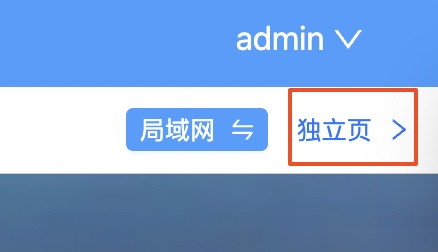

# 设置
## 一、用户设置

### 1.1 修改密码
`PC`端：鼠标悬浮在用户头像上，即可出现修改密码的菜单，

移动端：【设置】-【修改密码】

### 1.2 重置密码
因忘记密码等原因需要重置密码的，可通过下面步骤进行重置

- 停止服务
- 进入`iDocker`配置文件夹中的`config`文件夹
- 删除系统配置`systemConfig.yml`文件的`passwordHash`字段
- 启动服务，通过查看docker容器日志获取重置后的用户名和密码，或者在`logs`文件夹找到`init-password.txt`文件获取重置后的用户名和密码
  
### 1.3 密码尝试次数
在新设备密码登录尝试次数超过该次数将进行邮件提醒，未来可能自动加入`IP`封禁

### 1.4 二次验证（`2FA`）

[详解见安全部分内容](/guide/safe.html#二次验证-2fa)

## 二、导航页设置
### 2.1 导航页独立页是否公开
导航页独立页（非导航菜单页）默认不公开，需登录之后才能进行访问。

为方便用户使用导航页独立页，支持在【设置】->【导航页设置】->【基础设置】中将导航页设置为公开。
这样就可以在未登录的情况下直接访问【导航页独立页】，然后点击各个容器图标跳转到容器服务地址
::: tip
从导航独立页跳转到`iDocker`其他页面时仍需要进行登录才能操作
:::
::: tip 
只有配置了内外网地址的容器才会出现在导航页
:::
### 2.2 导航页壁纸
将壁纸图片复制到`iDocker`容器配置文件夹中的`wallpapers`文件夹中，点击切换壁纸的小风车按钮，即可从`wallpapers`文件夹中随机抽取一张图片作为背景壁纸

## 三、Docker设置
### 3.1 镜像源设置
目前经过可用性测试，预设了官方源及腾讯云、南京大学、上海交大三个镜像源，可自行删除添加其他镜像源

在`PC`端和移动端创建容器时都可选择已配置的镜像源镜像镜像拉取

### 3.2 预填充路径
新增容器挂载路径时，预填充该路径到宿主机路径输入框

## 四、通知设置
### 4.1 通知发件箱
目前支持`QQ`邮箱、微软邮箱和网易`163`邮箱作为发件箱，选择邮箱类型后需填入邮箱账户和授权码（或邮箱密码）并保存。[如何获取授权码](https://zhuanlan.zhihu.com/p/551399559)
::: tip
目前通知的收件箱默认为填写的发件箱账号（给自己发一份邮件），以后有必要的话再增加配置进行区分。
:::

目前支持邮件通知的的事件主要有：`Docker`相关事件(见4.2)、异常登录事件、新设备登录事件

### 4.2 `Docker`通知事件
支持配置`Docker`通知事件项，在已配置通知发件箱的前提下，当相应事件发生时会发送邮件进行提醒。